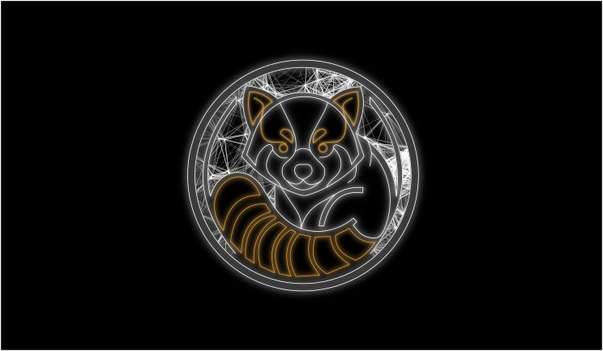

# Ailurus OS



---

<p align="center">
	<strong>➡️ <a href="https://github.com/bischoffjeremy/home-os/wiki/Getting-Started" style="font-size:1.3em;">Getting Started: Step-by-step install guide in the Wiki</a> ⬅️</strong>
</p>

---

Custom Fedora Aurora NVIDIA-Open image based on Universal Blue with KDE Plasma and immutable bootc/OSTree. Built with BlueBuild, deployed via GitHub Actions.

All images are signed with [Cosign](https://docs.sigstore.dev/cosign/overview/) and scanned for vulnerabilities with [Grype](https://github.com/anchore/grype).

---

## Build & Security Status

| Image | Build | Vuln Scan | Signed | Last Update |
|:------|:-----:|:---------:|:------:|:------------|
| **os-base** | [](https://github.com/bischoffjeremy/home-os/actions/workflows/build.yml) | [](https://github.com/bischoffjeremy/home-os/actions/workflows/build.yml) | [](https://github.com/bischoffjeremy/home-os/actions/workflows/build.yml) |  |
| **dev-general** | [](https://github.com/bischoffjeremy/home-os/actions/workflows/build-devcontainer.yml) | [](https://github.com/bischoffjeremy/home-os/actions/workflows/build-devcontainer.yml) | [](https://github.com/bischoffjeremy/home-os/actions/workflows/build-devcontainer.yml) |  |
| **dev-docs** | [](https://github.com/bischoffjeremy/home-os/actions/workflows/build-devcontainer-docs.yml) | [](https://github.com/bischoffjeremy/home-os/actions/workflows/build-devcontainer-docs.yml) | [](https://github.com/bischoffjeremy/home-os/actions/workflows/build-devcontainer-docs.yml) |  |
| **dev-media** | [](https://github.com/bischoffjeremy/home-os/actions/workflows/build-devcontainer-media.yml) | [](https://github.com/bischoffjeremy/home-os/actions/workflows/build-devcontainer-media.yml) | [](https://github.com/bischoffjeremy/home-os/actions/workflows/build-devcontainer-media.yml) |  |
| **dev-pentest** | [](https://github.com/bischoffjeremy/home-os/actions/workflows/build-devcontainer-pentest.yml) | [](https://github.com/bischoffjeremy/home-os/actions/workflows/build-devcontainer-pentest.yml) | [](https://github.com/bischoffjeremy/home-os/actions/workflows/build-devcontainer-pentest.yml) |  |

---

## Installed Default Apps
| App | Description |
|:---:|:------------|
|  | **Brave Browser** - Privacy focused browser |
|  | **VS Code** - Code editor |
|  | **Obsidian** - Markdown notes |
|  | **Anki** - Flashcard learning system |
|  | **Xournal++** - PDF annotation |
|  | **Bitwarden** - Password manager |
|  | **Ksnip** - Screenshot tool |
|  | **VLC** - Media player |
|  | **YouTube Music Desktop** - Music streaming |
|  | **Burp Suite** - Security testing |
|  | **ProtonVPN** - VPN client |
|  | **PDF Arranger** - PDF editor |

---

## Dev Containers

This project includes open-source Distrobox dev containers that anyone can use freely. They are built automatically via GitHub Actions and published to `ghcr.io`.

| Container | Purpose | Image |
|-----------|---------|-------|
| **dev-general** | Python, Node.js, Podman/Docker CLI, VS Code | `ghcr.io/bischoffjeremy/dev-general:latest` |
| **dev-docs** | TeX Live, LibreOffice, Pandoc | `ghcr.io/bischoffjeremy/dev-docs:latest` |
| **dev-media** | GIMP, Inkscape, Krita, Kdenlive, Blender, Audacity | `ghcr.io/bischoffjeremy/dev-media:latest` |
| **dev-pentest** | Kali MCP Server – HTTP API auf Port 5000 (`http://localhost:5000/mcp`) | `ghcr.io/bischoffjeremy/dev-pentest:latest` |

```bash
distrobox create --name dev-general --image ghcr.io/bischoffjeremy/dev-general:latest
distrobox enter dev-general
```

---

## Supply-Chain Security

All images are signed with [Cosign](https://docs.sigstore.dev/cosign/overview/) and scanned with [Grype](https://github.com/anchore/grype). Builds run daily and on every push.

| Image | Report |
|:------|:------:|
| os-base | [Security Report](https://github.com/bischoffjeremy/home-os/actions/workflows/build.yml) |
| dev-general | [Security Report](https://github.com/bischoffjeremy/home-os/actions/workflows/build-devcontainer.yml) |
| dev-docs | [Security Report](https://github.com/bischoffjeremy/home-os/actions/workflows/build-devcontainer-docs.yml) |
| dev-media | [Security Report](https://github.com/bischoffjeremy/home-os/actions/workflows/build-devcontainer-media.yml) |
| dev-pentest | [Security Report](https://github.com/bischoffjeremy/home-os/actions/workflows/build-devcontainer-pentest.yml) |

Verify any image:

```bash
cosign verify ghcr.io/bischoffjeremy/os-base:latest \
  --certificate-oidc-issuer https://token.actions.githubusercontent.com \
  --certificate-identity-regexp "github.com/bischoffjeremy/home-os"
```

---

## Fork and Customize

This image is built on top of [Universal Blue](https://universal-blue.org/) using [BlueBuild](https://blue-build.org/). The entire OS is defined in `recipe.yml` -- fork this repo, edit the recipe to your liking, and GitHub Actions will build your own custom image automatically.

---

<!-- For more details, see the Wiki. -->
